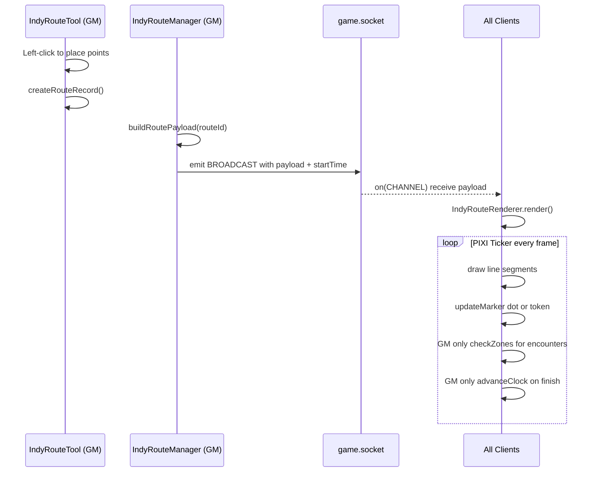
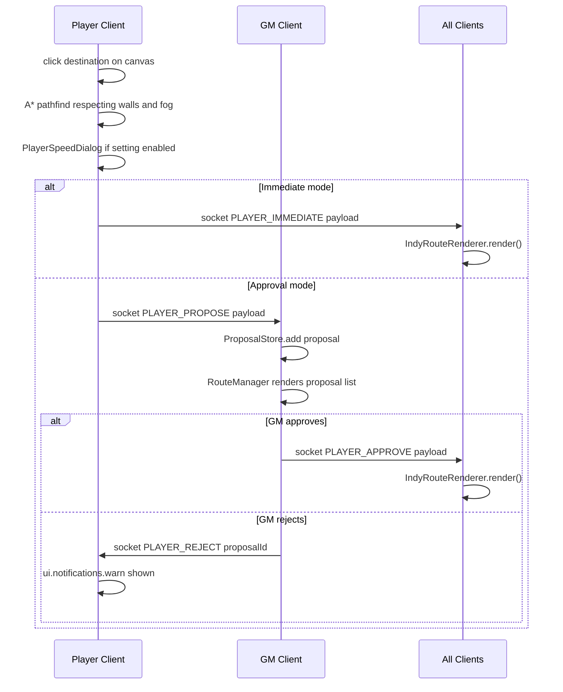
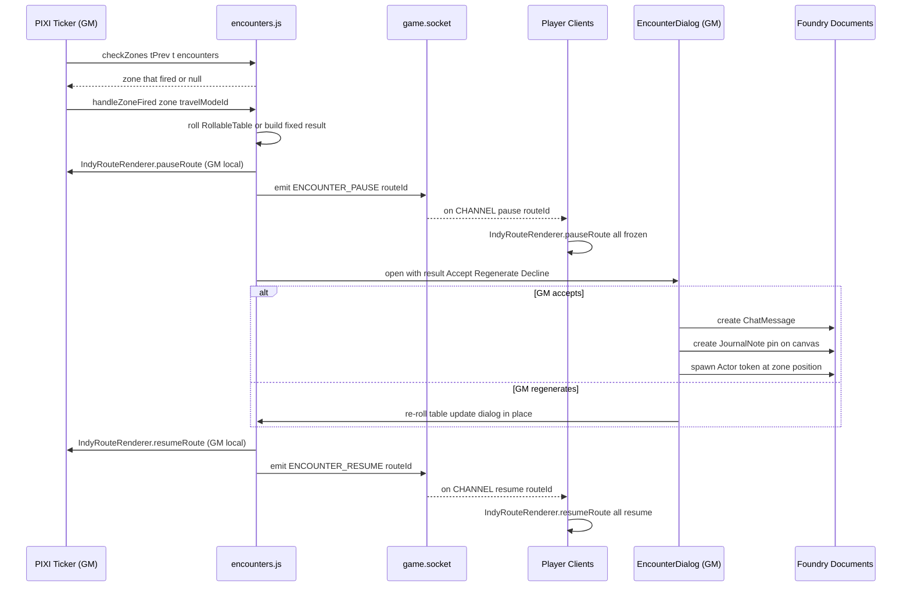

# Traveler — Developer Documentation

> For user-facing documentation see [README.md](README.md).

---

## Table of Contents

- [Repository Structure](#repository-structure)
- [Architecture Overview](#architecture-overview)
- [Key Design Decisions](#key-design-decisions)
- [Module Entry Point & Lifecycle](#module-entry-point--lifecycle)
- [Data Model](#data-model)
- [Socket Communication](#socket-communication)
- [Testing](#testing)
  - [Unit Tests (Vitest)](#unit-tests-vitest)
  - [Integration Tests (Quench + Docker)](#integration-tests-quench--docker)
  - [Test Fixtures](#test-fixtures)
- [Local CI Setup](#local-ci-setup)
- [Remote CI (GitHub Actions)](#remote-ci-github-actions)
- [Changelog Convention](#changelog-convention)

---

## Repository Structure

```
traveler/
├── module.json                   Foundry VTT manifest
├── scripts/
│   ├── traveler.js               Module entry point — hooks, settings, sockets
│   ├── settings.js               DEFAULTS, travel modes, helpers
│   ├── constants.js              MODULE_ID, CHANNEL, MSG socket type strings
│   ├── routes.js                 Route record CRUD + buildRouteFromPoints()
│   ├── renderer.js               PIXI animation engine (IndyRouteRenderer)
│   ├── tool.js                   GM canvas drawing tool (IndyRouteTool)
│   ├── tool-player.js            Player A* pathfinding tool + proposal submit
│   ├── proposals.js              Ephemeral in-memory GM proposal store
│   ├── encounters.js             Encounter zone logic, table rolling, resolution
│   ├── clock.js                  World clock advance (computeTravelSeconds etc.)
│   ├── smoothing.js              Catmull-Rom and Chaikin smoothing algorithms
│   ├── label-renderer.js         Route label rendering (path-following text)
│   ├── apps/
│   │   ├── manager.js            IndyRouteManager ApplicationV2 (Route Manager window)
│   │   ├── settings-app.js       IndyRouteSettingsBase / IndyRouteEditor
│   │   ├── encounter-dialog.js   EncounterDialog — GM Accept/Regen/Decline
│   │   ├── player-speed-dialog.js PlayerSpeedDialog — speed picker before proposal
│   │   ├── scene-settings.js     SceneSettingsDialog — distance override
│   │   ├── travel-modes.js       IndyRouteTravelModesApp — travel mode list editor
│   │   └── currencies.js         IndyRouteCurrenciesApp — currency conversion editor
│   ├── behaviors/
│   │   ├── change-level.js       TravelerChangeLevelBehavior (RegionBehaviorType)
│   │   └── level-check-dialog.js TravelerLevelCheckDialog — skill check dialog
│   └── pathfinding/
│       ├── astar.js              Grid A* with binary min-heap priority queue
│       └── fog-checker.js        Fog-of-war / vision cell check helpers
├── templates/                    Handlebars templates for all ApplicationV2 dialogs
├── tests/
│   ├── setup.js                  Vitest global Foundry mocks (canvas, game, PIXI…)
│   ├── unit/                     Vitest unit tests (no Foundry runtime required)
│   │   ├── astar.test.js
│   │   ├── change-level.test.js
│   │   ├── clock.test.js
│   │   ├── encounters.test.js
│   │   ├── player-speed.test.js
│   │   ├── proposals.test.js
│   │   └── settings.test.js
│   ├── quench/                   Quench integration tests (run inside live Foundry)
│   │   ├── index.js              Registers all batches
│   │   ├── fixtures.js           SceneFixture + WallFixture — programmatic world data
│   │   ├── pathfinding.quench.js
│   │   ├── region-behavior.quench.js
│   │   ├── player-route.quench.js
│   │   ├── encounters.quench.js
│   │   └── clock.quench.js
│   └── world/
│       └── world.json            Minimal world manifest for Docker CI
├── docs/
│   ├── encounters.plan.md
│   ├── player-pathfinding.plan.md
│   ├── testing.plan.md
│   └── travel-time.plan.md
├── docker-compose.test.yml       Docker Compose for local integration testing
├── scripts/
│   ├── run-quench.js             Playwright CI driver
│   ├── foundry-wait.js           Polls /api/status until Foundry is ready
│   └── world-clean.js            Resets tests/world/ to pristine state
├── .github/workflows/ci.yml      GitHub Actions workflow
├── vitest.config.js
├── package.json
├── .env.example
└── CHANGELOG.md
```

---

## Architecture Overview

### GM Route Playback



### Player Proposal Flow



### Encounter Zone Resolution



---

## Key Design Decisions

### System-agnostic core

The module does not import any game-system API. All system-specific logic is:
- Delegated to the GM via Rollable Tables (encounters)
- Expressed as free-text formulas (`checkFormula: "1d20+3"`) evaluated via Foundry's Roll API
- Driven by item name patterns and status effect ids the GM configures per-region

This means the module works with D&D 5e, Pathfinder, Dragonbane, and any other system.

### Client-side rendering, socket-synced start time

Routes are not re-broadcast on every frame. The GM emits the full payload **once** with a
`startTime` timestamp. Every client independently runs the PIXI animation using `Date.now()`
relative to `startTime`. This keeps bandwidth minimal and animations in sync even with brief
packet delay.

### ESM throughout; no build step

All source files use native ES modules (`type: "module"` in `module.json`). Foundry v14 loads
them directly. There is no bundler, no transpile step, no `dist/` directory.

### Circular import avoidance via `globalThis`

`renderer.js` needs encounter and clock logic at tick time, but importing those modules would create
circular dependencies (`renderer ← encounters ← renderer`). The solution: `traveler.js` (the entry
point) performs the imports and attaches helpers to named `globalThis` objects:

```js
globalThis.__travelerEncounters = { checkZones, handleZoneFired, resetZoneTriggers };
globalThis.__travelerClock      = { advanceClock };
```

The renderer reads from these at runtime. This is intentional, documented, and tested.

### Encounter animation pause (all clients)

When an encounter zone fires, **all clients** pause simultaneously. The sequence is:

1. GM's renderer is paused locally (immediate, no round-trip delay).
2. GM emits `ENCOUNTER_PAUSE` via socket → all player clients freeze at the same point.
3. GM interacts with the EncounterDialog (accept / regenerate / decline).
4. GM's renderer resumes locally.
5. GM emits `ENCOUNTER_RESUME` → all player clients continue from where they stopped.

This means players see their token freeze mid-route, the GM resolves the encounter, and then
everyone resumes together. The NPC token and Note created on "accept" appear on all clients via
normal Foundry document creation.

### Per-scene distance override vs. Foundry grid

Foundry's `canvas.scene.grid.distance` is designed for combat (e.g. "5 ft per square"). Overland
maps need "100 miles per square". Rather than asking GMs to switch their grid, Traveler stores an
independent `sceneDistance` flag on the scene document. `getSceneDistanceConfig()` always prefers
the flag when present and falls back to the native grid otherwise.

### Player pathfinding — fog boundary anchor

Standard A* cannot pathfind through unexplored cells (the goal cell's fog state is unknown). When
the destination is in fog, the pathfinder returns the path to the last explored cell on the way.
A pulsing anchor indicator is drawn at that boundary. When the player's vision expands (e.g. the
party moves), the `sightRefresh` hook triggers a re-evaluation from the anchor toward the original
destination.

---

## Module Entry Point & Lifecycle

`scripts/traveler.js` runs in three Foundry hook phases:

| Hook | What happens |
|---|---|
| `init` | Register region behavior; register module settings; pre-load templates; expose encounter and clock helpers on `globalThis` |
| `getSceneControlButtons` | Add GM and player toolbar buttons |
| `ready` | Expose the public API (`game.modules.get("traveler").api`); register socket handlers; expose PlayerRouteTool globally; register Quench suites if Quench is active |

---

## Data Model

### Route record (stored in scene flag `traveler.routes`)

```js
{
  id:         string,         // randomID()
  name:       string,
  points:     [{ x, y, elevation? }],  // raw GM-placed waypoints
  settings:   RouteSettings,  // visual + animation settings
  encounters: EncounterZone[],
  createdAt:  number,
  updatedAt:  number
}
```

### RouteSettings (key fields)

```js
{
  travelMode:    string,   // travel mode id or "none"
  levelId:       string,   // Scene Level document id
  defaultElevation: number,
  drawSpeed:     number,   // px/sec
  lineColor:     string,   // CSS hex
  cinematicMovement: boolean,
  // … many visual fields
}
```

### EncounterZone

```js
{
  id:          string,
  type:        "explicit" | "auto" | "fixed",
  t:           number,        // 0.0–1.0 along route (explicit/fixed)
  frequency:   number,        // 0.0–1.0 interval (auto)
  chance:      number,        // 0.0–1.0
  tableId:     string | null,
  tableName:   string,
  actorId:     string | null, // fixed type
  label:       string,
  environment: string,
  spawnToken:  boolean,
  createNote:  boolean,
  chatMessage: boolean,
  _triggered:  boolean        // runtime only, not persisted
}
```

### PlayerRouteProposal (in-memory only, ProposalStore)

```js
{
  id:              string,
  userId:          string,
  playerName:      string,
  tokenId:         string,
  tokenName:       string,
  sceneId:         string,
  path:            [{x, y}],
  settings:        RouteSettings,
  travelModeId:    string | null,
  travelModeLabel: string | null,
  submittedAt:     number
}
```

---

## Socket Communication

All messages use channel `module.traveler`.

| MSG constant | Direction | Payload | Effect |
|---|---|---|---|
| `BROADCAST` | GM → all | route payload | All clients render the route |
| `CLEAR_ROUTE` | GM → all | `{ routeId }` | All clients clear that route |
| `CLEAR` | GM → all | — | All clients clear all routes |
| `PLAYER_IMMEDIATE` | player → all | route payload | All clients render immediately |
| `PLAYER_PROPOSE` | player → GM | proposal object | GM queues proposal |
| `PLAYER_APPROVE` | GM → all | route payload | All clients render approved route |
| `PLAYER_REJECT` | GM → player | `{ proposalId }` | Player receives rejection notification |
| `ENCOUNTER_PAUSE` | GM → all | `{ routeId }` | All clients freeze the named route's animation |
| `ENCOUNTER_RESUME` | GM → all | `{ routeId }` | All clients resume the named route's animation |

> `ENCOUNTER_PAUSE` / `ENCOUNTER_RESUME` are defined but not currently used. The encounter dialog
> only pauses the GM's local animation, which is sufficient for the current UX.

---

## Testing

### Unit Tests (Vitest)

**Run:**
```powershell
npm test                  # single run
npm run test:watch        # watch mode
npm run coverage          # V8 coverage report → coverage/
```

**Stack:** [Vitest](https://vitest.dev/) + native ESM. No browser required.

**Global mocks** are in `tests/setup.js`, registered via `vitest.config.js`:
- `canvas` (grid, walls, visibility, scene, app)
- `game` (user, settings, socket, tables, actors, scenes, journal, folders, packs)
- `CONST`, `foundry`, `Hooks`, `ui`, `ChatMessage`, `Roll`, `PIXI`

Pure functions are tested without any mocking. Functions that call `game.*` use the stubs.

**Test files:**

| File | What it tests |
|---|---|
| `astar.test.js` | A* pathfinding (walls, diagonal, fog filter, budget) |
| `change-level.test.js` | Region behavior prerequisite checks, elevation resolution |
| `clock.test.js` | `computeTravelSeconds`, `formatTravelDuration` edge cases |
| `encounters.test.js` | `checkZones` (explicit, auto, fixed, t=0 boundary), `buildFixedResult` |
| `player-speed.test.js` | `scaleDrawSpeed`, `encounterMult` coverage, `getTravelModeById` |
| `proposals.test.js` | `ProposalStore` CRUD, snapshots, deduplication |
| `settings.test.js` | `normalizeSettings`, `applyColorNumbers`, `getPlayerRouteMode` |

---

### Integration Tests (Quench + Docker)

**Stack:** [Quench](https://github.com/Ethaks/FVTT-Quench) (Mocha inside Foundry) + 
[Playwright](https://playwright.dev/) (headless browser driver) + Docker
(`felddy/foundryvtt:14`).

Quench batches are registered in `tests/quench/index.js` and run against a live Foundry instance
inside Docker. Playwright handles login, world load, test execution, and result collection.

**Test batches:**

| Batch | What it tests |
|---|---|
| `traveler.integration.pathfinding` | A* on a live canvas with real walls and regions |
| `traveler.integration.regionBehavior` | `traveler.changeLevel` behavior checks |
| `traveler.integration.playerRoute` | Player route proposal → approval → playback |
| `traveler.integration.encounters` | Zone checks, note creation, chat messages, EncounterDialog |
| `traveler.integration.clock` | `advanceClock` against `game.time`, scene flag override |

---

### Test Fixtures

`tests/quench/fixtures.js` exports `SceneFixture.build()` which programmatically creates a
complete test scene:

- 1000×1000 scene with 100px grid
- Vertical wall at x=300 with a gap at y=400–500
- Stairwell region (automatic elevation change, no check)
- Cliff Face region (elevation change behind a roll check DC 1)
- A player token at (50, 400)

Each `FixtureContext` exposes a `teardown()` method that deletes the scene and all embedded
documents. Teardown is skipped when `window.TRAVELER_KEEP_WORLD === true` (inspect mode).

---

## Local CI Setup

**Prerequisites:**
- Docker Desktop
- Node.js ≥ 20
- A Foundry VTT license

**Steps:**

```powershell
# 1. Copy .env.example to .env and fill in credentials
Copy-Item .env.example .env
# edit .env with your FOUNDRY_LICENSE_KEY, FOUNDRY_ADMIN_KEY, FOUNDRY_USERNAME, FOUNDRY_PASSWORD

# 2. Start Foundry in Docker
npm run foundry:up        # docker-compose up -d

# 3. Wait for Foundry to finish initialising (~2-3 min on first run)
npm run foundry:wait

# 4. Install the Quench module inside Foundry (first time only)
# Navigate to http://localhost:30000, log in, Settings → Add-on Modules → Install Quench

# 5. Run integration tests
npm run test:integration

# 6. (Optional) inspect mode — keeps test data in the world
npm run test:inspect
# Then open http://localhost:30000 and log in as GM

# 7. Reset world data when done inspecting
npm run world:clean

# 8. Stop the container
npm run foundry:down

# 9. Full reset (also wipes named volume — requires re-activation)
npm run foundry:down:clean
```

**Named volumes:**

The `foundry-data` named volume persists Foundry's config, user accounts, and module installs
between `foundry:up` / `foundry:down` cycles. Only `foundry:down:clean` destroys it.

The `tests/world/` bind mount persists world data (scenes, actors, DB files) to the local
filesystem. The world.json manifest is tracked by git; all other files are git-ignored.

---

## Remote CI (GitHub Actions)

Workflow: `.github/workflows/ci.yml`

**Triggers:** push to any branch, PR to `main`.

**Jobs:**

| Job | Runner | What it does |
|---|---|---|
| `unit-tests` | `ubuntu-latest` | `npm ci && npm test` — fast, no Docker |
| `integration-tests` | `ubuntu-latest` | Spins up Docker Compose, waits for Foundry, runs Quench via Playwright |

**Secrets required** (set in GitHub → Settings → Secrets → Actions):

| Secret | Used by |
|---|---|
| `FOUNDRY_LICENSE_KEY` | docker-compose.test.yml |
| `FOUNDRY_ADMIN_KEY` | docker-compose.test.yml + run-quench.js |
| `FOUNDRY_USERNAME` | docker-compose.test.yml (felddy image download) |
| `FOUNDRY_PASSWORD` | docker-compose.test.yml |

The integration job does **not** run by default on forks or branches that lack secrets —
Foundry's activation requires a real license key.

> **Note on CircleCI:** CircleCI supports Docker-in-Docker for running Compose. The same
> workflow translates directly; replace the `runs-on: ubuntu-latest` GitHub Action steps with
> CircleCI `machine` executor steps. The `docker-compose.test.yml` file is CI-system-agnostic.

---

## Changelog Convention

The `CHANGELOG.md` follows [Keep a Changelog](https://keepachangelog.com/en/1.0.0/) format.

- Each commit is listed by hash under `### Commits` while in an unreleased cycle.
- When a version is tagged, the `[Unreleased]` section is promoted to `[vX.Y.Z] — YYYY-MM-DD`.
- Feature sections (`### Added — ...`) describe what changed at a file level.
- Bugs fixed mid-cycle are noted under `### Fixed`.

The `*(pending)*` placeholder is used when the commit hash is not yet known (replaced on the
next commit).
