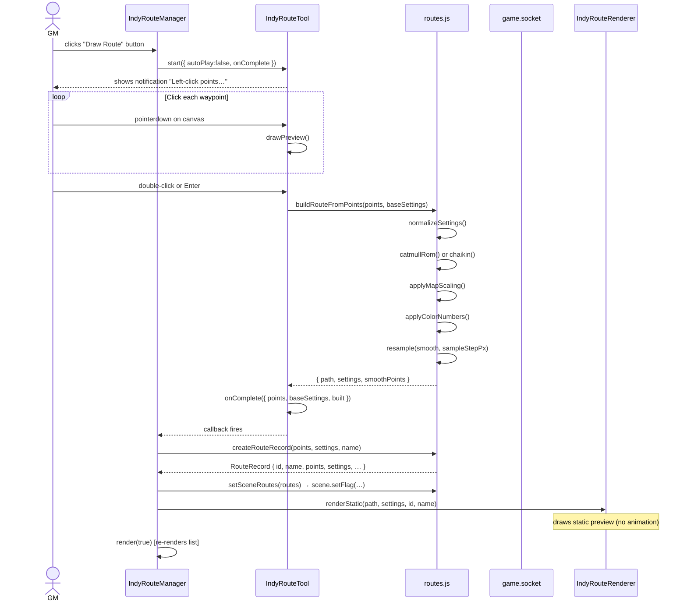
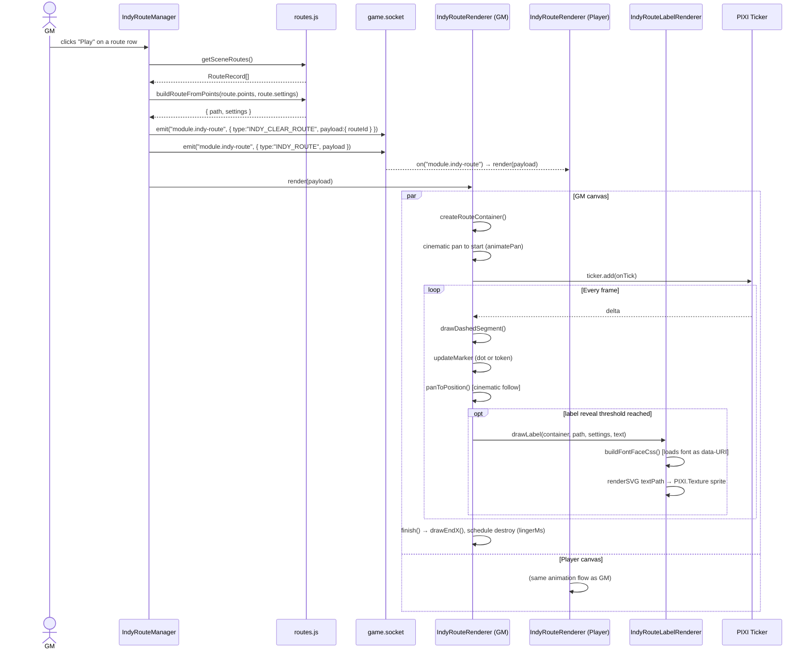
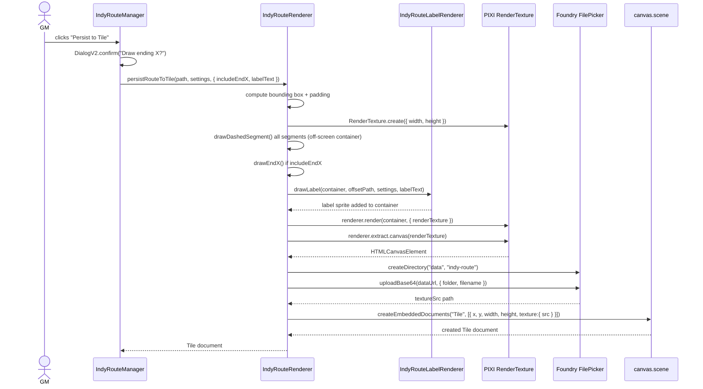
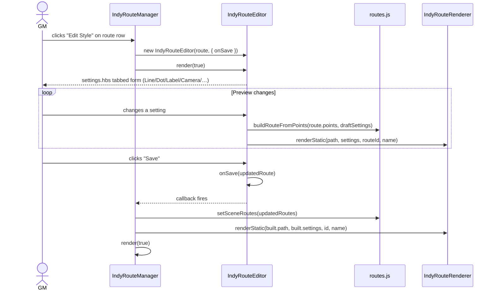
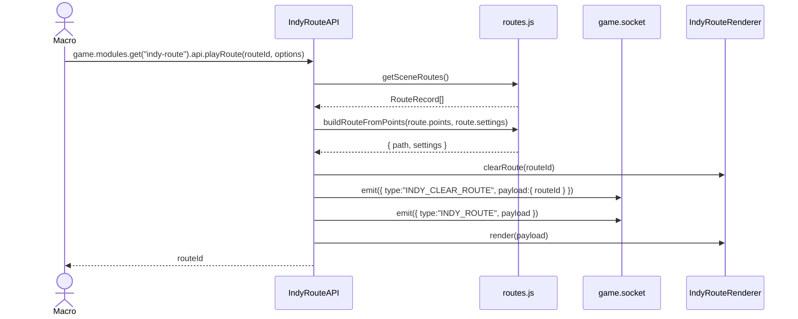
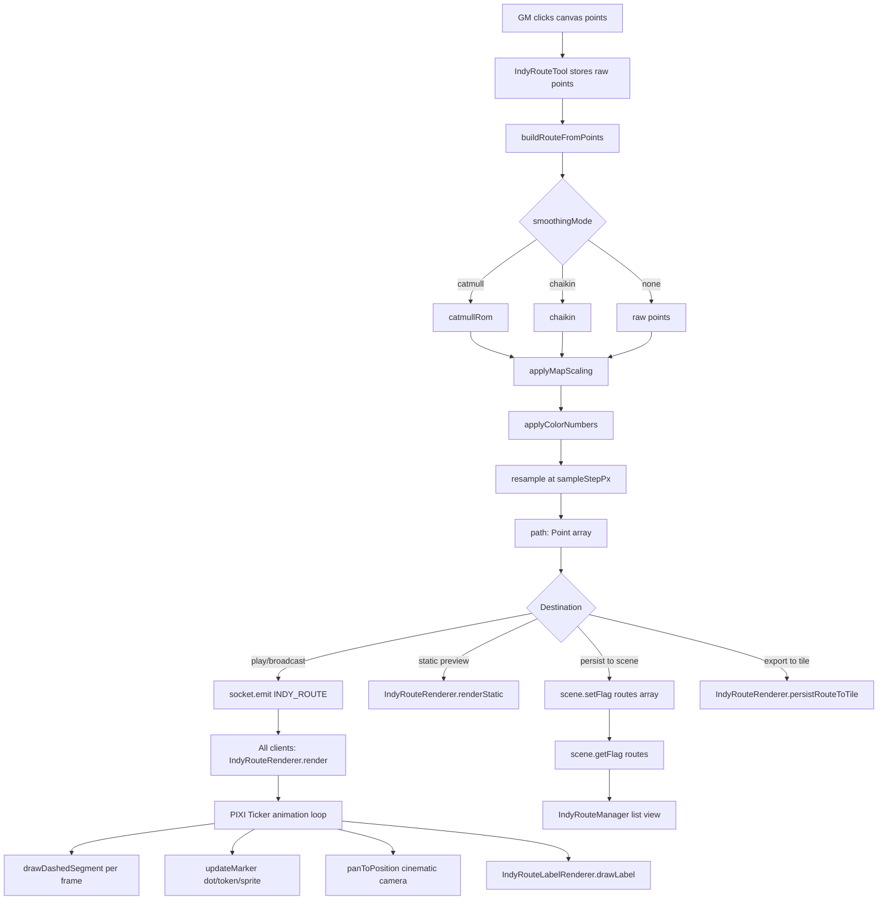

# Indy Route — Architecture Document

## Overview

**Indy Route** (`indy-route`) is a Foundry VTT v13 module that gives a GM the ability to interactively draw, save, animate, and share travel routes on the canvas. Routes are drawn as smooth, optionally dashed lines with animated dot/token movement, cinematic camera panning, path-following labels, sound playback, and travel-time/cost tooltips derived from configurable travel modes. All animation is synchronised across every connected client via Foundry's built-in socket system.

The module requires **no build step**: it ships as plain ES modules loaded directly by Foundry's module loader.

---

## Functional Areas

| Area | Description |
|------|-------------|
| **Route Drawing** | GM clicks points on the canvas; the tool draws a live preview line and emits the finished route via socket on completion. |
| **Smoothing** | Raw click-points are smoothed with Catmull-Rom (default) or Chaikin subdivision before being resampled at a fixed pixel step to produce the final `path` array. |
| **Rendering** | Animated dashed-line drawing, moving dot/token sprite, optional cinematic camera pan/zoom, end-of-route X marker, and fade-in label. All via PIXI.js primitives on `canvas.primary` or `canvas.effects`. |
| **Label Rendering** | SVG `<textPath>` technique embeds text along the route curve. Fonts are loaded from `CONFIG.fontDefinitions` and inlined as base64 data-URIs so the SVG renders correctly in WebGL textures. |
| **Persistence** | Routes are stored as flag data on the Scene document: `scene.setFlag("indy-route", "routes", [...])`. Each route record stores raw click-points (not the smoothed path) plus its settings snapshot, enabling re-smoothing at any time. |
| **Multiplayer Sync** | Three socket message types (`INDY_ROUTE`, `INDY_CLEAR_ROUTE`, `INDY_CLEAR`) propagate render and clear events to all clients in real-time. |
| **Tile Export** | A route can be rendered to an off-screen PIXI `RenderTexture`, extracted as PNG, uploaded to the server, and placed as a locked Tile on the scene — creating a permanent, non-animated map overlay. |
| **Route Manager UI** | ApplicationV2 + Handlebars panel listing all routes for the current scene. Supports drag-to-reorder, play, preview, edit points, edit style, persist-to-tile, clear, delete, export JSON, import JSON. |
| **Settings UIs** | Tabbed ApplicationV2 forms for global defaults, per-route style overrides, travel mode CRUD, and currency conversion CRUD. |
| **Travel Calculations** | Route tooltips compute distance (pixels → scene units), travel time (units ÷ speed), and fare cost (days/hours × rate), formatted as multi-denomination currency strings. |
| **Public API** | `game.modules.get("indy-route").api` exposes `drawRoute`, `createRoute`, `playRoute`, `drawRouteToTile`, `clearRoute`, `clearAllRoutes`, `listRoutes`, `getRouteByName`, `help` for macro/script automation. |

---

## Repository Structure

```
traveler/                         ← Foundry module root (module id: indy-route)
│
├── module.json                   ← Module manifest (id, socket: true, esmodules)
├── README.md                     ← User documentation
├── LICENSE                       ← MIT
│
├── scripts/                      ← All JavaScript (plain ES modules)
│   ├── indy-route.js             ← Entry point: Foundry Hooks, socket handler, public API
│   ├── constants.js              ← MODULE_ID-derived socket CHANNEL constant
│   ├── settings.js               ← DEFAULTS, travel modes, scaling helpers, normalizeSettings
│   ├── routes.js                 ← Route data: build/smooth/resample, CRUD on scene flags
│   ├── smoothing.js              ← Catmull-Rom and Chaikin smoothing algorithms
│   ├── tool.js                   ← IndyRouteTool – interactive canvas click-to-draw tool
│   ├── renderer.js               ← IndyRouteRenderer – PIXI animation engine
│   ├── label-renderer.js         ← IndyRouteLabelRenderer – SVG textPath labels
│   └── apps/
│       ├── manager.js            ← IndyRouteManager   (ApplicationV2, route-manager.hbs)
│       ├── settings-app.js       ← IndyRouteSettingsApp + IndyRouteEditor (settings.hbs)
│       ├── travel-modes.js       ← IndyRouteTravelModesApp (travel-modes.hbs)
│       └── currencies.js         ← IndyRouteCurrenciesApp  (currencies.hbs)
│
├── templates/                    ← Handlebars templates (inline <style> blocks)
│   ├── route-manager.hbs         ← Route list with toolbar and per-row actions
│   ├── settings.hbs              ← Tabbed style editor (General/Line/Dot/Label/…)
│   ├── travel-modes.hbs          ← Travel mode card editor
│   ├── currencies.hbs            ← Currency conversion editor
│   └── route-editor.hbs          ← Legacy single-page editor (unused by current JS)
│
├── images/
│   ├── actor_play.mp4
│   └── Token Play Sync.mp4
│
└── .vscode/
    ├── tasks.json                ← robocopy deploy task to local Foundry data folder
    └── launch.json               ← VS Code launch config
```

---

## Class Diagram

```mermaid
classDiagram
    direction TB

    %% ── Entry / Bootstrap ──────────────────────────────────────────────────
    class IndyRouteModule {
        +Hooks.once("init")
        +Hooks.on("getSceneControlButtons")
        +Hooks.once("ready")
        -buildRoutePayload(options) Object
        -applyRouteOverrides(settings, options) Object
        -resolveSettings(settings) Object
        +api: IndyRouteAPI
    }

    %% ── Public API ─────────────────────────────────────────────────────────
    class IndyRouteAPI {
        +drawRoute(options) routeId|null
        +createRoute(options) Promise~routeId|null~
        +playRoute(routeId, options) routeId|null
        +drawRouteToTile(routeIdOrOptions, options) Promise~Tile|null~
        +clearRoute(routeId) void
        +clearAllRoutes() void
        +listRoutes(sceneId?) RouteRecord[]
        +getRouteByName(name, sceneId?) RouteRecord|null
        +help() Object
    }

    %% ── Settings ───────────────────────────────────────────────────────────
    class SettingsModule {
        <<module>>
        +MODULE_ID: string
        +DEFAULTS: RouteSettings
        +DEFAULT_TRAVEL_MODES: TravelMode[]
        +getTravelModes() TravelMode[]
        +getMapPixelSize() Size|null
        +applyMapScaling(settings, sizeOverride?) RouteSettings
        +getStageScale() number
        +getCameraScaleForPath(totalLen, zoomFactor) number|null
        +getSettings() RouteSettings
        +applyColorNumbers(settings) RouteSettings
        +normalizeSettings(settings) RouteSettings
    }

    %% ── Smoothing ──────────────────────────────────────────────────────────
    class SmoothingModule {
        <<module>>
        +chaikin(points, iterations, closed?) Point[]
        +catmullRom(points, samplesPerSegment, alpha) Point[]
    }

    %% ── Route Data ─────────────────────────────────────────────────────────
    class RoutesModule {
        <<module>>
        +buildRouteFromPoints(points, baseSettings) BuiltRoute
        +getSceneRoutes(scene?) RouteRecord[]
        +setSceneRoutes(routes, scene?) Promise~void~
        +createRouteRecord(points, baseSettings, name) RouteRecord
        -resample(points, stepPx) Point[]
    }

    %% ── Drawing Tool ───────────────────────────────────────────────────────
    class IndyRouteTool {
        <<singleton object>>
        +state: ToolState|null
        +start(options) void
        +clearAllBroadcast() void
        -finishAndBroadcast() void
        -drawPreview(mousePos?) void
        -cleanup(notice?) void
    }

    %% ── Renderer ───────────────────────────────────────────────────────────
    class IndyRouteRenderer {
        <<singleton object>>
        +render(payload) void
        +renderStatic(path, settings, routeId, labelText, options?) void
        +clearLocal() void
        +clearRoute(routeId) void
        +clearPreview() void
        +persistRouteToTile(path, settings, options?) Promise~Tile|null~
        -createRouteContainer(settings) ContainerSet
        -drawDot(dot, x, y, settings, angleRad) void
        -drawEndX(container, x, y, settings, size) void
        -drawDashedSegment(graphics, a, b, dashState, dashLen, gapLen) void
        -ensureTokenSprite(container, settings) void
        -resolveTokenTexture(uuid) Promise~Texture|null~
        -resolveRouteToken(uuid) Promise~TokenDocument|null~
        -resolveRouteTokenInfo(uuid) Promise~TokenInfo~
        -resolveRouteSound(value) Promise~string|null~
        -snapshotFogExploration() FogSnapshot
        -restoreFogExploration(snapshot) Promise~void~
        -moveTokenMarker(tokenDoc, x, y) void
    }

    %% ── Label Renderer ─────────────────────────────────────────────────────
    class IndyRouteLabelRenderer {
        -fontFaceCache: Map
        -fontDataCache: Map
        +drawLabel(container, path, settings, text, options?) Promise~LabelResult~
        +computeLabelSpanInfo(path, settings, text) SpanInfo|null
        -buildFontFaceCss(fontFamily) Promise~string~
        -getFontDataUrl(url) Promise~string~
        -getFontMimeFromUrl(url) string
    }

    %% ── UI Applications ────────────────────────────────────────────────────
    class IndyRouteManager {
        <<ApplicationV2>>
        +selectedId: string|null
        +static show() IndyRouteManager
        +_prepareContext() Object
        -_drawRoute() void
        -_playRoute(routeId) void
        -_previewPlayback(routeId) void
        -_previewRoute(route) void
        -_persistRoute(routeId) Promise~void~
        -_editRoute(routeId) void
        -_editRoutePoints(routeId) void
        -_deleteRoute(routeId) Promise~void~
        -_clearRoute(routeId) void
        -_renameRoute(routeId, name) Promise~void~
        -_exportRoutes() void
        -_importRoutes() void
        -_getRouteLengthLabel(route) string
        -_formatCostCurrency(cost) string
    }

    class IndyRouteSettingsBase {
        <<ApplicationV2>>
        #_buildTabsConfig() Object
        #_renderCurrentTab() Promise~void~
    }

    class IndyRouteSettingsApp {
        <<ApplicationV2>>
        +render(force) void
    }

    class IndyRouteEditor {
        <<ApplicationV2>>
        -route: RouteRecord
        -onSave: Function
        +render(force) void
    }

    class IndyRouteTravelModesApp {
        <<ApplicationV2>>
        +_prepareContext() Object
        -_addMode() Promise~void~
        -_deleteMode(id) Promise~void~
        -_saveMode(id, data) Promise~void~
    }

    class IndyRouteCurrenciesApp {
        <<ApplicationV2>>
        +_prepareContext() Object
        -_addEntry() Promise~void~
        -_deleteEntry(index) Promise~void~
        -_saveEntries(data) Promise~void~
    }

    %% ── Data Records ───────────────────────────────────────────────────────
    class RouteRecord {
        +id: string
        +name: string
        +points: Point[]
        +settings: RouteSettings
        +createdAt: number
        +updatedAt: number
    }

    class RouteSettings {
        +lineColor: string
        +lineAlpha: number
        +lineWidth: number
        +dashLength: number|null
        +gapLength: number|null
        +showLabel: boolean
        +labelColor: string
        +labelFontFamily: string
        +labelFontSize: number
        +labelFollowPath: boolean
        +labelShowArrow: boolean
        +labelPosition: number
        +scaleWithMap: boolean
        +cinematicMovement: boolean
        +showEndX: boolean
        +renderAboveTokens: boolean
        +dotColor: string
        +dotRadius: number
        +showDot: boolean
        +dotTokenUuid: string
        +routeSound: string
        +travelMode: string
        +travelFareTier: string
        +drawSpeed: number
        +lingerMs: number
        +sampleStepPx: number
        +smoothingMode: string
    }

    class TravelMode {
        +id: string
        +label: string
        +speedMph: number
        +perDayMiles: number
        +costPerHour?: Object
        +costPerDay?: Object
    }

    class SocketPayload {
        +sceneId: string
        +path: Point[]
        +settings: RouteSettings
        +startTime: number
        +lingerMs: number
        +routeId: string|null
        +labelText: string
    }

    %% ── Relationships ──────────────────────────────────────────────────────
    IndyRouteModule --> IndyRouteAPI : exposes at game.modules api
    IndyRouteModule --> IndyRouteTool : registers toolbar button
    IndyRouteModule --> IndyRouteManager : registers toolbar button
    IndyRouteModule --> IndyRouteRenderer : socket → render/clear

    IndyRouteAPI --> RoutesModule : createRoute / listRoutes
    IndyRouteAPI --> IndyRouteRenderer : drawRoute / playRoute / clear
    IndyRouteAPI --> IndyRouteTool : clearAllRoutes

    IndyRouteManager --> IndyRouteTool : start() for draw/edit-points
    IndyRouteManager --> IndyRouteRenderer : render / renderStatic / clear
    IndyRouteManager --> IndyRouteEditor : opens per-route style editor
    IndyRouteManager --> RoutesModule : CRUD

    IndyRouteTool --> RoutesModule : buildRouteFromPoints
    IndyRouteTool --> IndyRouteRenderer : render (local + broadcast)

    IndyRouteRenderer --> IndyRouteLabelRenderer : drawLabel / computeLabelSpanInfo
    IndyRouteRenderer --> SettingsModule : getCameraScaleForPath / DEFAULTS

    RoutesModule --> SmoothingModule : chaikin / catmullRom
    RoutesModule --> SettingsModule : normalizeSettings / applyMapScaling / applyColorNumbers

    IndyRouteSettingsApp --|> IndyRouteSettingsBase
    IndyRouteEditor --|> IndyRouteSettingsBase

    RouteRecord *-- RouteSettings
    SocketPayload o-- RouteSettings
```



---

## Sequence Diagrams

### 1 · GM Draws a New Route (Tool → Broadcast → Render)



---

### 2 · Playing a Saved Route (Animated, Multi-Client)



---

### 3 · Persisting a Route to a Tile (PNG Export)



---

### 4 · Route Manager — Edit Route Style



---

### 5 · Public API — Macro Triggers a Route



---

## Data Flow Summary



---

## Key Design Decisions

| Decision | Rationale |
|----------|-----------|
| **Store raw click-points, not smoothed path** | Allows re-smoothing with different algorithms without data loss; map-scaling is re-applied at play-time so routes render correctly at any zoom. |
| **Socket emit does not loop back to sender** | Foundry's socket `emit` does not deliver to the originating client; `IndyRouteRenderer.render()` is therefore called explicitly on the GM's client after every `emit`. |
| **`window.__indyRouteBroadcast` global** | Provides a single, consistent registry of active PIXI containers across all render calls without requiring a module-level singleton that could be lost on hot-reload. |
| **SVG textPath for labels** | PIXI's native text cannot follow a curve. The SVG data-URI approach creates a rasterised texture from an SVG containing `<textPath>`, which PIXI can render as a sprite along the path. Fonts are fetched and inlined so the off-document SVG can access them. |
| **`lingerMs: -1` means persist forever** | Routes that should stay on the map indefinitely use `-1` as a sentinel; positive values schedule a `setTimeout` destroy after animation completes. |
| **No build step** | Keeps the development loop simple (robocopy to local Foundry data) and avoids bundler complexity for a module of this size. |
| **`scaleMapSize` snapshot in `createRouteRecord`** | When `scaleWithMap` is enabled, the current map pixel dimensions are saved alongside the route so that the scaling ratio can be reproduced identically when the route is later played back. |
