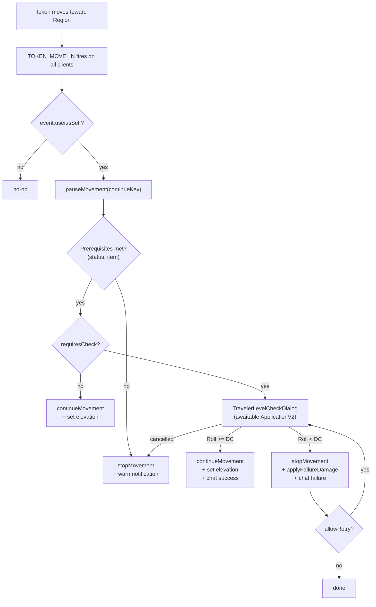

# Region "Change Level" Behavior

## How it fits into Foundry v14



## New Files

### `scripts/behaviors/change-level.js`

Extend `foundry.data.regionBehaviors.RegionBehaviorType`.

**Schema fields** (registered in `CONFIG.RegionBehavior.dataModels["traveler.changeLevel"]`):

- `mode` — `StringField`, choices: `stairs | ladder | cliff | drop | fly-only`, default `"stairs"`
- `targetLevelId` — `StringField` — Level document ID to transition the token to
- `targetElevation` — `NumberField` — exact `elevation` value written to the token
- `requiredStatusEffect` — `StringField` — e.g. `"flying"` or `"spider-climb"`; empty = no requirement
- `requiredItemPattern` — `StringField` — regex tested against `actor.items` names; empty = no requirement
- `requiresCheck` — `BooleanField` default `false`
- `checkLabel` — `StringField` default `"Traversal Check"` — shown in dialog title
- `checkFormula` — `StringField` default `"1d20"` — any valid Roll expression; actor data is available via `@`
- `checkDC` — `NumberField` default `10`
- `failureDamage` — `StringField` — dice formula e.g. `"2d6"`; empty = no damage
- `allowRetry` — `BooleanField` default `false`

Core method (`_handleRegionEvent`):
```js
async _handleRegionEvent(event) {
  if (event.type !== CONST.REGION_EVENTS.TOKEN_MOVE_IN) return;
  if (!event.user.isSelf) return;                // only the moving user acts

  const tokenDoc = event.data.token;
  const movementId = event.data.movement?.id;
  const continueKey = this.parent.uuid;

  const paused = tokenDoc.pauseMovement?.(continueKey);
  if (!paused) return;

  // prerequisite check …
  // dialog loop (while allowRetry) …
  // continue or stop …
}
```

### `scripts/behaviors/level-check-dialog.js`

`TravelerLevelCheckDialog extends foundry.applications.api.HandlebarsApplicationMixin(ApplicationV2)`

- Constructor accepts `{ behavior, tokenDoc }` and creates `this.promise = new Promise(…)`
- `_prepareContext` — builds `{ checkLabel, formula, dc, actorName, modeName, canAttempt }`
- Two buttons wired via `_attachPartListeners`:
  - **Attempt** — evaluates `new Roll(formula, actorData).evaluate()`, posts to chat, resolves promise with `{ success, roll, cancelled: false }`
  - **Give Up** — resolves promise with `{ success: false, roll: null, cancelled: true }`, closes dialog
- Template: `modules/traveler/templates/level-check-dialog.hbs`

### `templates/level-check-dialog.hbs`

- Shows actor name, behavior mode icon, check label, formula, DC
- "Attempt" and "Give Up" buttons
- Displays last roll result inline when retrying

## Modified Files

### [`module.json`](module.json)

Add a `"templates"` array (Foundry pre-loads these on `init`):
```json
"templates": ["templates/level-check-dialog.hbs"]
```

### [`scripts/traveler.js`](scripts/traveler.js)

In `Hooks.once("init")`:
```js
import { TravelerChangeLevelBehavior } from "./behaviors/change-level.js";
// …
CONFIG.RegionBehavior.dataModels["traveler.changeLevel"] = TravelerChangeLevelBehavior;
```

Import and register before any settings — registration must happen in `init`.

### [`CHANGELOG.md`](CHANGELOG.md)

Add entry under `[Unreleased]`.

## Key Implementation Notes

- **Damage application** — `applyFailureDamage` tries, in order: `actor.applyDamage(total)` (dnd5e/pf2e common), then `actor.update({"system.attributes.hp.value": hp - total})`, then falls back to posting a roll to chat with a warning.
- **Elevation update** — `tokenDoc.update({ elevation: this.targetElevation }, { animate: false })` called after `continueMovement` (v14 standard).
- **Roll data** — actor data injected via `Roll(formula, tokenDoc.actor?.getRollData?.() ?? {})` for `@` references.
- **Prerequisite checks** — status via `actor?.statuses?.has(statusId)`; items via a `new RegExp(pattern, "i")` test against `item.name`; either field empty means that requirement is skipped.
- **No socket work needed** — `TOKEN_MOVE_IN` with `event.user.isSelf` guard means the dialog runs naturally on the correct player's client; `pauseMovement`/`continueMovement`/`stopMovement` are all called on that same client.
- **RegionBehavior config form** — Foundry auto-generates form fields from the DataModel schema in `RegionConfig`; no custom config template needed for MVP.
